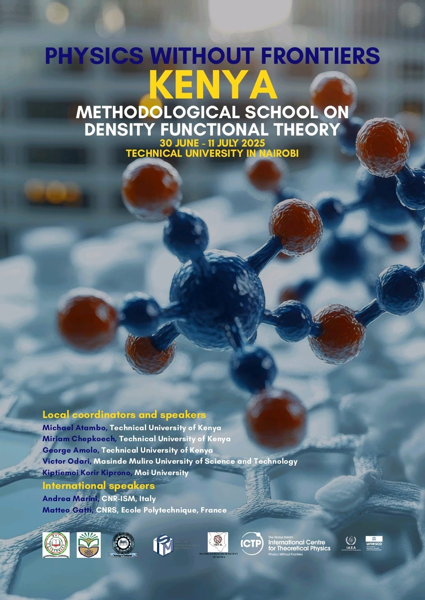

<html lang="en">
<head>
    
</head>
<body>
    <h1>Welcome to Materials Modelling Group</h1>

    

        <h2>NEW: CIMPA School 2027 — Fundamentals of Density Functional Theory</h2>
        

            The Materials Modelling Group at the Technical University of Kenya is proud to announce that we have been awarded funding to host a 
            <strong>CIMPA School in June/July 2027</strong>. This intensive 10-day program focuses on the deep theoretical and mathematical foundations of DFT.
        

        

            In collaboration with <strong>CNRS</strong> and <strong>Ecole Polytechnique (France)</strong>, this school aims to empower the next generation of African researchers 
            to move beyond "black-box" computation and become active contributors to theoretical methodology.
        

        

            <a href="" class="btn" style="background: #004a99; color: white; padding: 10px 20px; text-decoration: none; border-radius: 5px;">Read Full Announcement</a>
        

    

    

        <h2>Advancing Methodological Excellence: ICTP-PWF Methodological School</h2>
        

            The <a href="https://materials-modelling-group.github.io/">Materials Modeling Group</a> 
            hosted the year-long APhRICA program, with an emphasis on methodological aspects of DFT. 
            The school trained participants from 7 different countries, with lecturers from Kenya, France, and Italy.
        

        
    

    

        <h2 style="margin-bottom:1.5cm;margin-top:1.5cm">Previous Announcements</h2>
        

</body>
</html>
